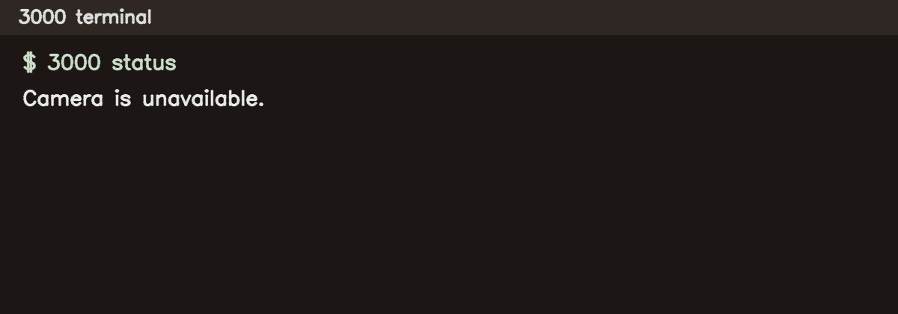
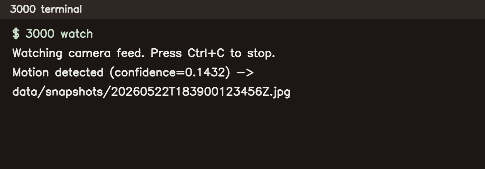

# 3000

[](https://github.com/5K-bit/3000/actions/workflows/ci.yml)

3000 is a local-first computer vision sentinel. It watches a camera feed, detects motion, saves snapshots, and writes events locally.

## Requirements

- Python 3.11+
- OpenCV-compatible camera source

## Install

```bash
python -m venv .venv
source .venv/bin/activate
pip install -e ".[dev]"
```

## Commands

```bash
3000 status
3000 snapshot
3000 watch
3000 events
```

## Screenshots

### 3000 status



### 3000 watch



### Command behavior

- `3000 status`: checks camera availability.
- `3000 snapshot`: captures one frame and writes it to `data/snapshots/`.
- `3000 watch`: runs frame-differencing motion detection. On motion:
  - saves snapshot
  - writes event to SQLite (`data/events.sqlite3`)
  - prints a Rich alert in terminal
- `3000 events`: lists recent detection events.

## Local data layout

- `data/snapshots/*.jpg`: captured frames
- `data/events.sqlite3`: SQLite event database

## Safety

- No cloud or network requirement.
- Handles camera access failures gracefully.
- Does not require a webcam to run tests.